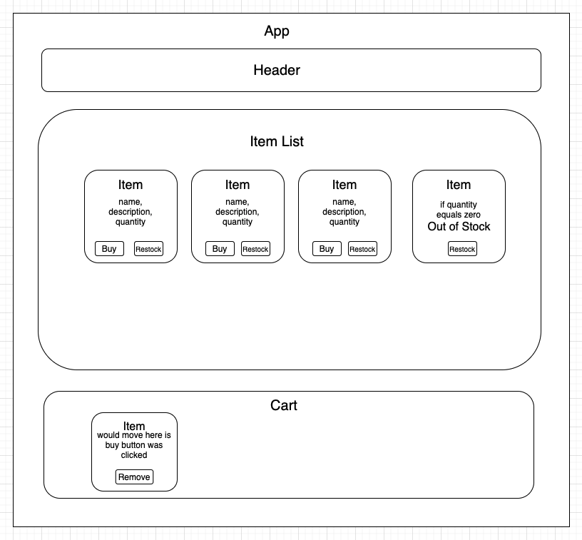

# _Juggalo Juice_

### By _**Jo Miller & Zack Rutledge**_

#### _This project was created solely for the education of the author(s) and is not in a complete or portfolio-ready state. It should not be considered representative of professional work._

[Epicodus](https://www.epicodus.com/) - [React](https://www.learnhowtoprogram.com/ruby-and-rails/) - [Week 2](https://www.learnhowtoprogram.com/react/react-fundamentals/help-queue-merch-site-event-logger-two-day-project)

#### Date created: 04/21/2021
---

## Technologies Used

* _React 3.2.0_
* _JavaScript_
* _Bootstrap_
* _MDBReact_
* _Webpack 4.41.0_
* _git 2.30.0_

---

## Description

A mock up of a merchandise site using only React components.

Are you a Juggalo? Do you need four simple things before you die? If you answered yes to any of these questions, you've come to the right place! Peruse our selection of Faygo and dream of that sweet sweet refreshment. Whoop whoop, fam!

## Component Diagram

---

## Setup/Installation

* You will need to use your system's **terminal emulator** to setup and locally use this application.
* This project uses npm as a package manager, you can download it [here](https://www.npmjs.com/get-npm).
* To clone this directory, navigate in your terminal to the desired location of the project and run command `git clone https://github.com/joanna-miller/juggalo-juice.git`
* Navigate to top level of the directory with command `cd juggalo-juice`
* To install dependencies into the project run command `npm install`
* To launch this project in a browser, run command `npm run start`
* To exit live server, press Ctrl+C in your terminal

---

## Editing Instructions

* To use Visual Studio Code to edit this project, follow install instructions [here](https://code.visualstudio.com/).
* To enable command `code`, open VS Code, click on View > Command Palette, type in "shell command", and click on "Shell Command: Install 'code' command in PATH"
* Now, from your terminal, in the project's top level directory, you can run command `code .` to open project in VS Code.

---

## License

[MIT](LICENSE.txt)

---

## Contact Information

* _Contact Jo via [Email](mailto:joannadawnmiller@gmail.com) or [LinkedIn](https://www.linkedin.com/in/jomillerde/), or check out her [Github](https://github.com/joanna-miller)._
* _Contact Zack via [Email](mailto:thorgrim88@gmail.com) or [LinkedIn](https://www.linkedin.com/in/zack-rutledge762/), or check out his [Github](https://github.com/dethik)._